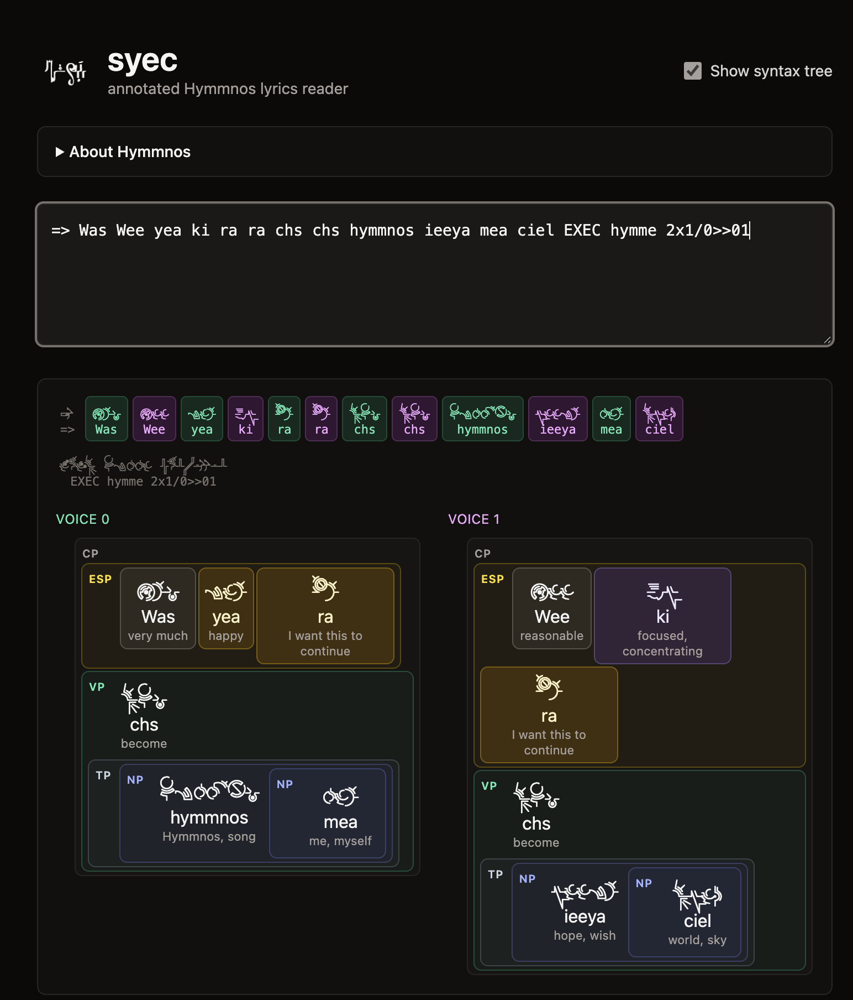

# syec

An annotated reader for Hymmnos, the constructed language of song magic from
the *Ar Tonelico* video game series. Paste a Hymmn and get an interlinear
gloss with emotion-sound highlighting, hover-for-definition popovers, and
Binasphere Chorus decoding. This is heavily vibe-coded. 

Live: <https://bubiche.github.io/hymmnos_syec/>




## What it does

- Tokenises pasted lyrics, looks each word up in a corpus of 866 entries
  spanning all seven dialects (Central, Cult Ciel, Cluster, Alpha, Metafalss,
  Pastalia, Alpha-EOLIA), and renders a three-row column per token: glyph,
  Latin reading, and a short gloss.
- Decorates Pastalia emotion verbs with their bank-slot fills and emotion
  vowels with their prefix/suffix, so a single compact word's components are
  legible.
- Decodes 2-voice Binasphere Chorus blocks (lines starting with `=>` and
  ending in `EXEC hymme Nx1/0>>pattern`) into side-by-side voice columns plus
  the original interleaved reference strip.
- Parses each sentence into a phrase tree (NP, VP, EVP, ESP, SP, PP, TP, AP,
  …) and wraps the matched tokens in nested tinted boxes — a port of the
  upstream `grammar.py`. A header toggle hides the boxes for a clean v1
  flat-token view.
- Recognises Persistent Emotion Sound blocks bracketed by `0x vvi.` and
  `1x AAs ixi.`: every body line inside the block parses as if the declared
  emotion-sound triple were prepended, and the row is marked with a yellow
  side bar so the persistent emotion is visible at a glance.
- Colours emotion-sound prefixes by category (joy / sorrow / anger / focus /
  love / fear / neutral) so the speaker's tone is visible at a glance.
- Hover or tap any word for the full dictionary entry across every matching
  dialect.

## Local development

This project pins pnpm via `.tool-versions`.

```sh
pnpm install
pnpm dev          # local dev server
pnpm typecheck    # tsc -b
pnpm test         # node --test on src/lib/*.test.ts
pnpm build        # production bundle to dist/
```

To rebuild the dictionary from upstream:

```sh
git clone https://github.com/flan/hymmnoserver.git
cp hymmnoserver/database/hymmnoserver.mysqldump data/upstream/
pnpm build-corpus
```

The mysqldump itself is gitignored; `data/corpus.json` is committed so a
fresh checkout can build the app without re-running the ETL.

## Credits

This project would not exist without the work of Akira Tsuchiya, Gust, the
[`flan/hymmnoserver`](https://github.com/flan/hymmnoserver) team, and the
font authors. See [CREDITS.md](./CREDITS.md) for full attribution.
